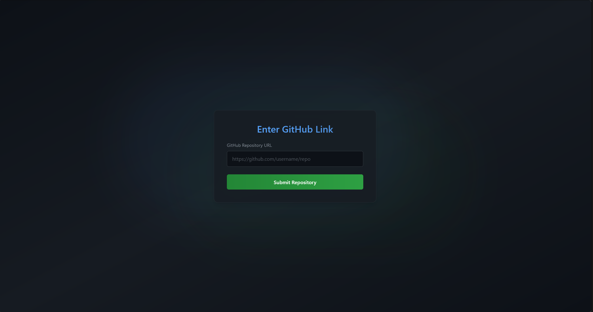

# DORA Tracker
A simple tool to track a repository DORA metrics, currently we only implement 2 out of 4 metrics: Lead time for changes and Deployment frequency

For more information about DORA metrics and how to calculate them, please visit [DevOps Research and Assessment (DORA) metrics](https://docs.gitlab.com/ee/user/analytics/dora_metrics.html)

## Usage


Input the link to your Github repository, for example: ["https://github.com/MusikStreaming/MusikStreamingBE"](https://github.com/MusikStreaming/MusikStreamingBE)

Currently, we only showcase this page and have not embed Metabase dashboard, once the request is sent, it should trigger the background worker to process, analyze the repository and save to MongoDB.

Moreover, this will only work for trunk-based development, well we track main branch, once it is merged or push to main branch, we will track for Docker deployments, releases and etc

## To-dos
- Make routes to display deployments info (for future use)
- Improve scanning logic
- Adding protection like JWT or custom X-API-Key headers

## Related Documentations
- [Expressjs](https://expressjs.com/en/4x/api.html): The server's core
- [Github API Documentation](https://docs.github.com/en/rest?apiVersion=2022-11-28) or just search in your browser if you want specific APIs.
- [Mongoose](https://mongoosejs.com/docs/typescript.html): A library to connect to MongoDB. You only need to know about `create` and `findOne`.
- [googleapis Documentation](https://www.npmjs.com/package/googleapis): This is the documentation of Google's SDK to authenticate and read Google Docs. For more information, watch this [video](https://www.youtube.com/watch?v=AxsuxUjzKdY&ab_channel=CodingwithAdo). Btw, Google documentation sucks.
- [Quick Bullmq Documentation](https://betterstack.com/community/guides/scaling-nodejs/bullmq-scheduled-tasks/): The server is packed with a background worker, whose job is to queue incoming jobs and process it. If i were to just implement normal API calls, it will be slow to get a response because it have a lot of await operations. 
- [Quick Typescript Documentation](https://www.typescriptlang.org/docs/handbook/typescript-in-5-minutes.html): Javascript's bahavious is a bit unpredictable, sometimes undefined, no checking for fields' errors and etc, so we use Typescript to enforce types on those bad boys.  

## Installation

### 0. Pre-installation
Before you install, make sure you have this in your .env file (or just prepare it if you use Docker):

```
PORT=5000
MONGO_URI="<YOUR_CONNECTION_STRING_HERE>"
MONGO_DB_NAME="<YOUR_DB_NAME_HERE>"

# You will be rate limited if this is not specified
# TO create your Personal Access Token (PAT) on Github, do the following:
# 1. Click on your profile icon > Settings
# 2. Scroll down and you will see `Developer Settings` on the left panel > Personal access token > Tokens (classic)
# 3. Create a new token, set the name, duration and with full control of private repositories > Generate token > Copy the token and paste it here (and save it somewhere safe for future use)

GH_PAT="<YOUR_GITHUB_PERSONAL_ACCESS_TOKEN_HERE>"

REDIS_URL="<YOUR_REDIS_URL_HERE>"
```

Quick Reminder: If you ever need a free place to deploy your apps, your redis database, you can deploy on [Render](https://render.com/). The only down side is that your server will spin down after 15 minutes.

### 1. Using Node.js

```
# Install all dependencies
npm install # or npm ci

# build
npm run build

# Start server
npm run start
```

### 2. Using Dockerfile

```
docker build -t <your-prefered-app-name> .

docker run -e PORT=5000 \
-e MONGO_URI='<smt>' \
-e MONGO_DB_NAME='<smt>' \
-e GH_PAT='<smt>' \
-e REDIS_URL='<smt>' \
-p 5000:5000 \
--name <container-name> <image-name>
```

After that, it should be available on `http://localhost:5000`

## License
[MIT](./LICENSE)
